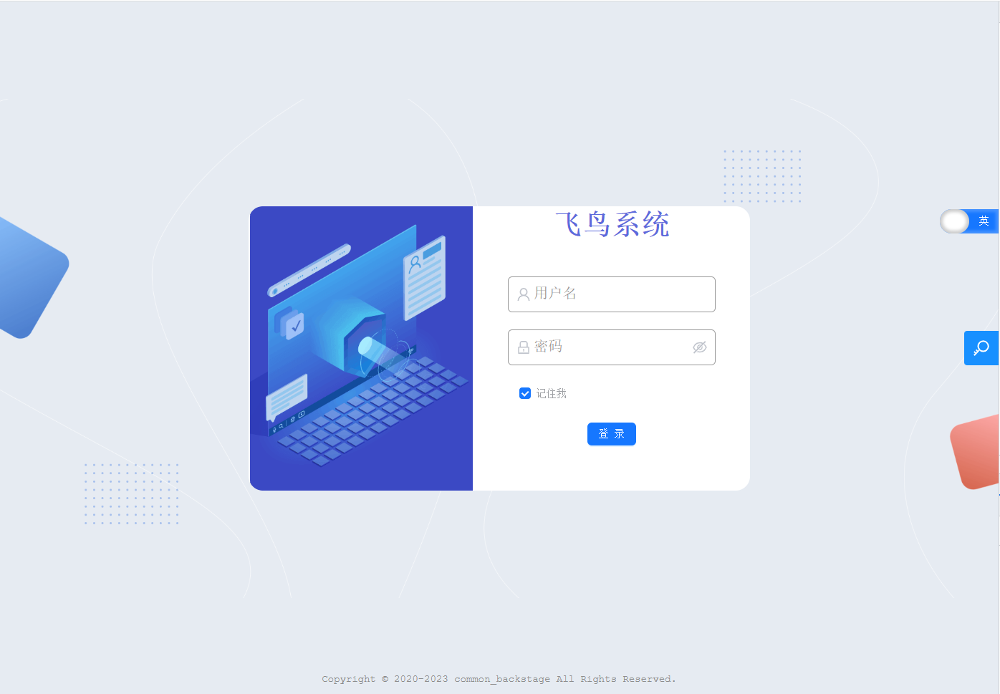
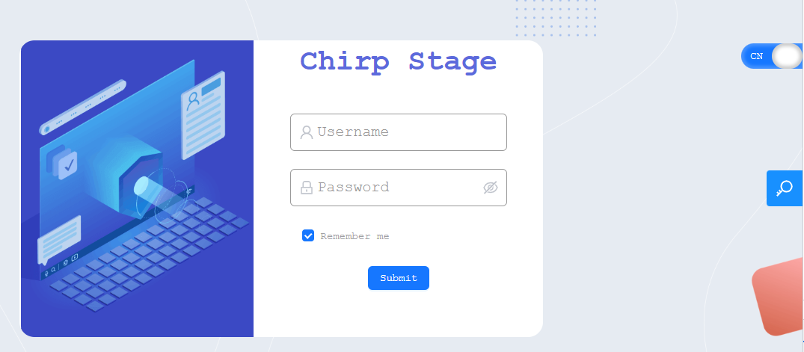
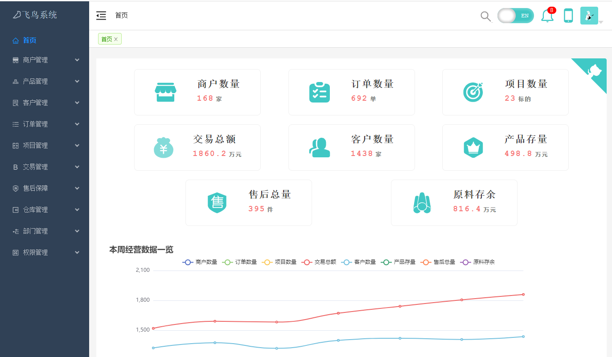

# 通用管理后台

## 技术栈

```html
html, css, less, js, typescript,

react@18+, redux, react-redux, react-router-dom, ant-design@5+, 

webpack, eslint, prettier, 

styled-components, echarts, lodash, Tesseract.js
```
## 实现功能

- 自定义搭建react-ts脚手架
- 配置国际化
- 权限管理
- 数据可视化
- 路由懒加载
- 规范化开发
- 路由搜索
- 路由记录
- 图片识别提取文本
- 手机扫码查看

---

## 页面展示

`登录页`



`中/英切换`



`首页`

